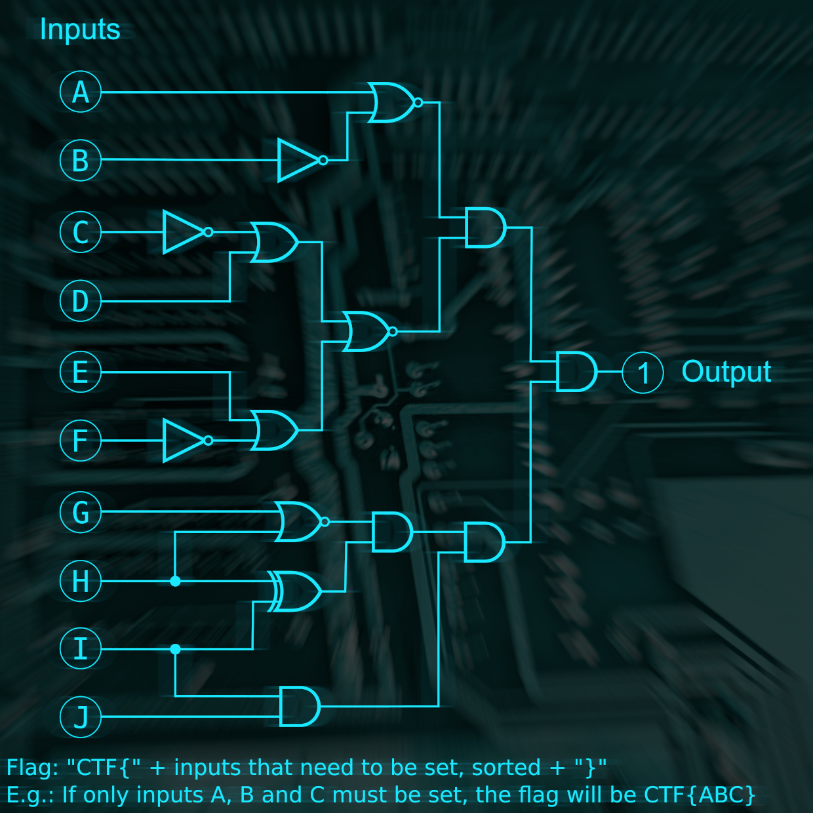

# 2

First i downloaded a file and rand file on it. `file file_name` and found out it was a zip folder. So I extracted it with unzip `unzip file_name`.
Then I got an image and opened it up.

The image was an puzzle of logic gates and I solved it by looking up how the different logic gates looked.

### Flag:
`CTF{BCFIJ}`
